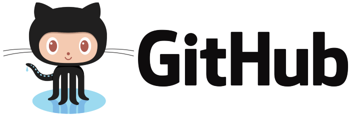

# Utilizando o GitHub para expor seus projetos de Data Science

[Link para a live no YouTube](https://www.youtube.com/watch?v=Kkco06E_ZOY) 

O evento vai acontecer nesse sábado (13/03) às 14h AO VIVO no nosso canal do YouTube!!! ⏰

Já pensou em criar um portfólio dos seus projetos de Data Science?  
Você já conhece o GitHub? Vamos te ajudar na sua jornada!  

Nesse evento vamos te ensinar a expor seus projetos de Data Science no GitHub e te dar dicas para divulgar seus projetos nas redes sociais.

Vamos utilizar os dados do curso de [Data Analyst in Python do Dataquest](https://www.dataquest.io/path/data-analyst/).

[Link do Dataset](https://data.world/data-society/used-cars-data)

## 📝 O que você vai aprender conosco:

- O que é o GitHub?
- O que é um repositório e como criar um?
- Onde desenvolver o seu projeto
- Explorar o Dataset - EDA
- Dicas para o README
- Subir no GitHub
- Divulgar seus projetos nas redes (LinkedIn, Medium, Dev.to…)

#### Iremos oferecer um certificado de participação!  
Basta você se inscrever no link do Sympla abaixo:

➡ [Link Meetup](https://bit.ly/evento1303-meetup)  
➡ [Link Sympla](https://bit.ly/evento1303-sympla)

#### Hosts do Evento:

Beatriz Maia - https://www.linkedin.com/in/beatrizmaiads/  
Marina Borges - https://www.linkedin.com/in/marinahsborges/

Inscreva-se no nosso canal do Youtube e ative a notificação: https://bit.ly/ai-inclusive-youtube

## Leitura Complementar:

Como criar o seu Github Profile - Artigo da Letícia Silva - https://bit.ly/3vdQo8v

Posts com dicas de onde encontrar datasets - https://bit.ly/3t3LA3V

### Cursos Gratuitos sobre Git:

Dataquest
https://bit.ly/2N8eQao

Udacity
https://bit.ly/30u7WPV

Codecademy
https://www.codecademy.com/learn/learn-git

Playlist Curso Git e GitHub - Gustavo Guanabara
https://bit.ly/3qzAd1Z

## *IMPORTANTE*

#### CÓDIGO DE CONDUTA
Qualquer pessoa que violar ou houver previamente violado o código de conduta desta comunidade terá sua entrada proibida, será expulsa e/ou estará sujeita à ação que a organização achar mais apropriada, independentemente de inscrição no evento, ser integrante do Meetup ou qualquer outra condição.

https://www.ai-inclusive.org/code-of-conduct/
